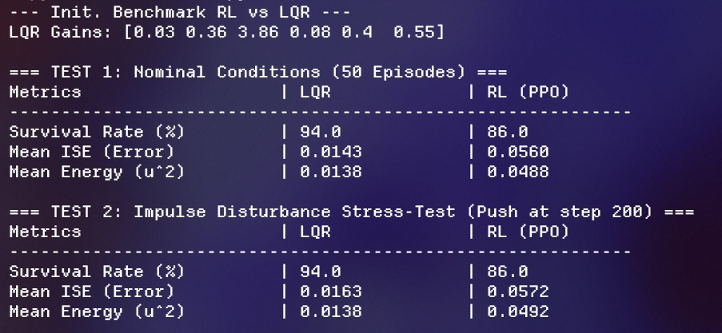

# Double Inverted Pendulum: Deep RL (PPO) vs. Discrete LQR

A side-by-side comparison between **classical optimal control (Discrete LQR)** and **Deep Reinforcement Learning (PPO)** on the chaotic Cart-Pole Double Inverted Pendulum (`InvertedDoublePendulum-v5` via Gymnasium & MuJoCo).

This project explores how a well-calibrated linear quadratic regulator performs against a learned neural policy when pushed to balance two coupled, highly unstable links on an actuated cart.

---

<p align="center">
  
</p>

---

## Table of Contents

- [Overview](#overview)
- [Benchmark Results](#benchmark-results)
- [Repository Structure](#repository-structure)
- [Quickstart](#quickstart)
- [Running the Scripts](#running-the-scripts)

---

## Overview

Controlling a double inverted pendulum on a moving cart is notoriously tricky: it is underactuated, non-linear, and exhibits chaotic dynamics. 

While Deep Reinforcement Learning (DRL) can discover stabilization strategies purely through trial and error, classical control theory offers mathematically grounded baselines. Here, we tune and pit both approaches against each other across identical seeded episodes to answer a simple question: **does a neural policy actually beat a properly linearized LQR in stabilization and energy efficiency?**

---

## Benchmark Results

Here is how both controllers stacked up over 50 evaluation episodes with identical initial conditions and an external push test ($\Delta v = +0.8\text{ m/s}$ applied to the cart at step 200):

| Metric | Discrete LQR | Deep RL (PPO) | Advantage / Notes |
| :--- | :---: | :---: | :--- |
| **Survival Rate (Nominal)** | **94.0%** | 86.0% | **LQR (+8.0%)** |
| **Survival Rate (0.8 m/s Push)** | **94.0%** | 86.0% | **LQR (+8.0%)** |
| **Mean ISE (Tracking Error $\downarrow$)** | **0.0143** / **0.0163** | 0.0560 / 0.0572 | **LQR (~3.9x cleaner)** |
| **Mean Energy ($u^2$ Effort $\downarrow$)** | **0.0138** / **0.0138** | 0.0488 / 0.0492 | **LQR (~3.5x more efficient)** |

### Practical Takeaways
* **Smoothness and Efficiency:** Around the upright point ($\theta_1 \approx 0, \theta_2 \approx 0$), LQR is near-optimal. It holds the links rock steady with virtually no chatter, consuming roughly 70% less energy than PPO.
* **Where LQR Struggles:** LQR relies on small-angle assumptions ($\sin\theta \approx \theta$). Its 6% failure rate happens entirely during extreme randomized resets where the starting angle falls outside the linear region or forces the cart past the track boundaries ($\vert{}x\vert{} \ge 2.4\text{ m}$).
* **PPO Behavior:** PPO handles larger non-linear recovery angles decently, but residual exploration noise leads to micro-vibrations and higher overall power consumption.

---

## Repository Structure

```
├── benchmark/
│   └── benchmark.py                      # 50-episode comparative test suite (RL vs LQR) under nominal and perturbed conditions
│   └── benchmark_results.png             # Visual snapshot of the terminal benchmark output
├── models/
│   ├── ppo_double_pendulum.zip           # Saved weights from single-process PPO training
│   └── ppo_double_pendulum_parallel.zip  # Saved weights from vectorized multi-core PPO training
├── sim_vis/
│   ├── simple_sim.py                     # Minimal sandbox to run and test MuJoCo physical dynamics
│   └── visualize.py                      # Real-time visual comparison with automated camera tracking
├── training/
│   ├── parallel_train_ppo.py             # Multi-environment parallel training pipeline using SubprocVecEnv
│   └── simple_train_ppo.py               # Baseline single-process PPO training script
├── .gitignore                            # Rules for excluding virtual environments, caches, and local IDE files
├── installation.txt                      # Step-by-step system requirements and environment setup guide
├── requirements.txt                      # Exact Python package dependencies (Gymnasium, MuJoCo, SB3, SciPy)
└── README.md                             # Project overview, mathematical formulation, and benchmark documentation
```

---

## Quickstart

### 1. Clone the Project
```bash
git clone [https://github.com/kushalgollen/Double-Inverted-Pendulum-Deep-RL-vs.-LQR-Control.git](https://github.com/kushalgollen/Double-Inverted-Pendulum-Deep-RL-vs.-LQR-Control.git)
cd Double-Inverted-Pendulum-Deep-RL-vs.-LQR-Control
```

### 2. Create and Activate Virtual Environment
```bash
# Create environment
python -m venv gym_env

# Activate on Windows (PowerShell):
.\gym_env\Scripts\Activate.ps1

# Activate on Linux / macOS:
source gym_env/bin/activate
```

### 3. Install Dependencies
```bash
pip install -r requirements.txt
```

---

## Running the Scripts

* **Run the complete benchmark (50 episodes, nominal + disturbance test):**
  ```bash
  python benchmark.py
  ```
* **Watch the controllers balance in real-time:**
  ```bash
  python visualize.py
  ```
* **Train PPO from scratch using parallel environments:**
  ```bash
  python parallel_train_ppo.py
  ```
* **Quick simulation check:**
  ```bash
  python simple_sim.py
  ```
